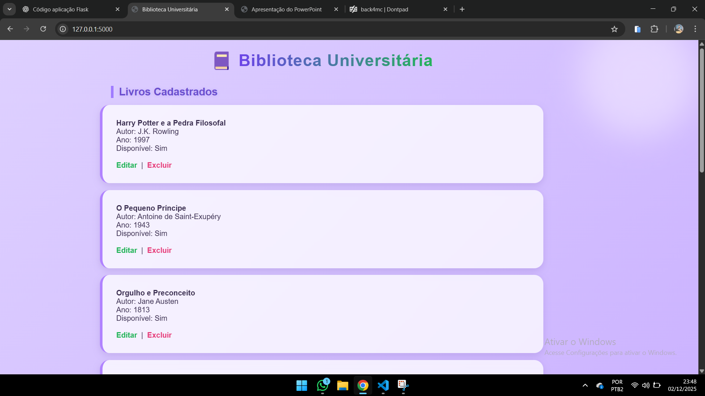
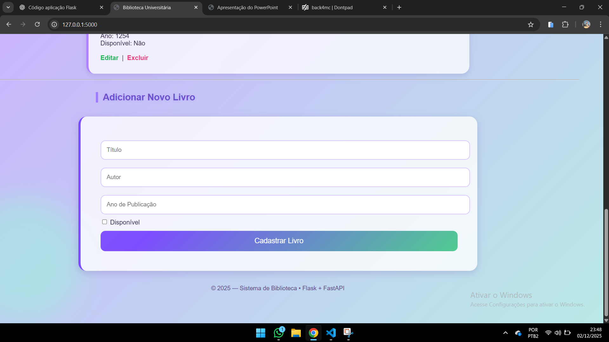

# 📚 Sistema de Biblioteca Universitária  
Aplicação desenvolvida para a disciplina de Back-End (AV2), utilizando **FastAPI**, **Flask** e **SQLite**.  
O sistema permite gerenciar livros através de uma API REST e de uma interface web.

---

# 🚀 Tecnologias Utilizadas
- **Python 3.10+**
- **FastAPI** – API principal
- **Uvicorn** – Servidor da API
- **Flask** – Interface web (frontend simples)
- **SQLite** – Banco de dados
- **Requests** – Comunicação entre Flask ↔ API FastAPI
- **HTML + CSS** – Interface de exibição dos livros

---

# 📌 Funcionalidades (CRUD Completo)
A aplicação permite:

✔ **Cadastrar** livros  
✔ **Listar** todos os livros  
✔ **Editar** informações dentro do próprio card  
✔ **Excluir** livros  
✔ Banco de dados persistente com SQLite  
✔ Comunicação entre Flask e FastAPI  
✔ Interface moderna com animação e glassmorphism  

---

# 📂 Estrutura do Projeto

Trabalho Final/
│ appflask.py
│ api_fast.py
│ biblioteca.db
│ README.md
│
├── templates/
│ index.html
│ editar.html (opcional, caso use)
│
└── static/
style.css


---

# ⚙️ Como Executar o Projeto

## 1️⃣ Instale as dependências

pip install fastapi uvicorn flask requests pydantic


---

## 2️⃣ Inicie a API FastAPI

Na pasta do projeto, execute:

uvicorn api_fast:app --reload --port 8000


A API estará disponível em:  
👉 http://127.0.0.1:8000  

Documentação automática:  
👉 http://127.0.0.1:8000/docs

---

## 3️⃣ Inicie o Flask

Em outro terminal:

python appflask.py


O sistema web estará em:  
👉 http://127.0.0.1:5000

---

# 🔗 Comunicação Flask ↔ FastAPI

O Flask consome a API FastAPI através de requisições:

Exemplo:

```python
API_URL = "http://127.0.0.1:8000"
response = requests.get(f"{API_URL}/livros")


O Flask NÃO acessa o banco diretamente.
Toda lógica é feita pela API.
```

# 🗃️ Banco de Dados SQLite

O arquivo biblioteca.db é criado automaticamente no primeiro uso.
Contém a tabela:

livros (
    id INTEGER PRIMARY KEY AUTOINCREMENT,
    titulo TEXT,
    autor TEXT,
    ano_publicacao INTEGER,
    disponivel INTEGER (0/1)
)

# 📝 Endpoints da API
✔ GET /livros

Lista todos os livros.

✔ GET /livros/{id}

Retorna um livro específico.

✔ POST /livros

Adiciona um novo livro.

✔ PUT /livros/{id}

Atualiza um livro existente.

✔ DELETE /livros/{id}

Exclui um livro do banco.

# 🎨 Interface Web (Flask)

A interface possui:

✔ Lista de livros em cards
✔ Botão Editar que abre um formulário dentro do card
✔ Botão Excluir
✔ Formulário para cadastrar novos livros
✔ Estilização moderna com animação, gradiente e glassmorphism

# 🖼️ Prints da Aplicação





# 👨‍💻 Autores

- Jônatas Monteiro, Vitor Roberto, Maria Eduarda, Alan Alves
- Trabalho final — Disciplina de Back-End
- Professor: Flávio
